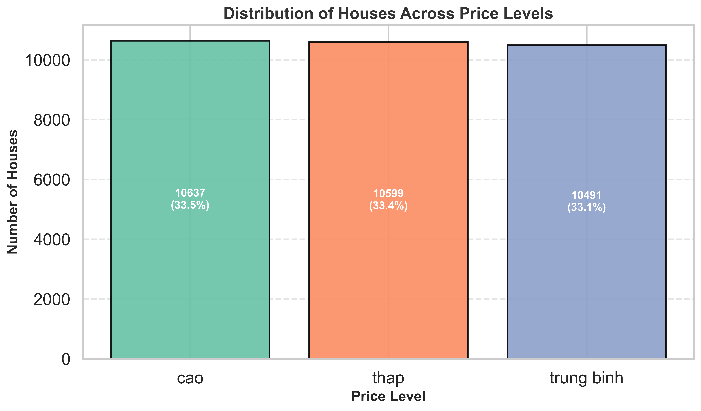
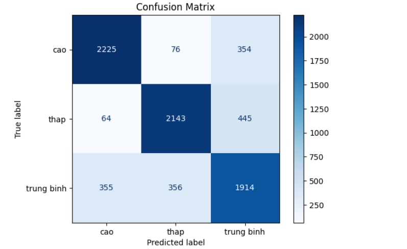
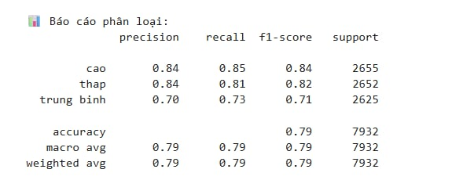

# House Price Level Classification

This project focuses on building a deep learning model to classify the **price levels of houses** in Vietnam.  
The data is collected by **web scraping from [chotot.vn](https://www.chotot.vn/)** using Selenium, and then used to train a **Feed Forward Neural Network (FFNN)** with 4 layers. 
The model performs classification on three classes representing price levels: High, Low, and Average.

---

## Dataset
Due to privacy and licensing reasons, the dataset is **not publicly available in this repository**.  

To request access, please contact: **nguyenbao1072004@gmail.com**  
Note: The dataset is provided **strictly for research purposes only** and must **not** be used for any commercial purposes.

The level of data distribution in 3 layers: High, Medium, Low.

## How to train a model
Install dependencies from **requirements.txt:**
```
   pip install -r requirements.txt
```
Refine the data_loader.py file, when you have contacted and obtained the dataset, adjust the path as follows.
```python
# data_loader.py

# Original path
data = pd.read_csv('text.csv')

# Update with your local path
data = pd.read_csv('dataset_name.csv')
```
Run the file **main.py** to train the model and observe the experimental results.
```
   python main.py
```
## Evaluate the results
Below, the confusion matrix shows the class levels.


Precision, Recall, and Accuracy metrics for evaluating each class for three class.



